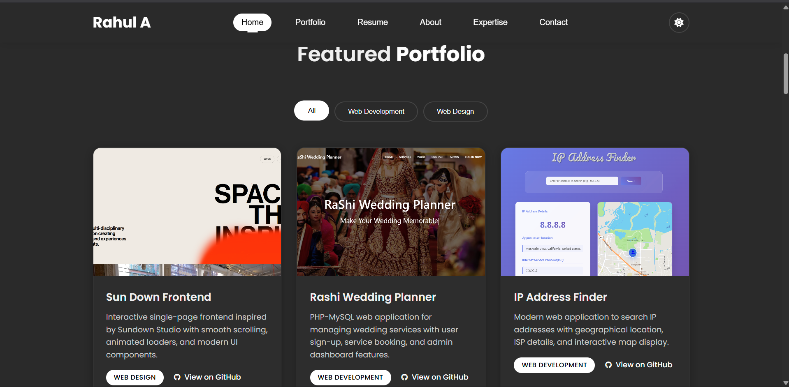

# Rahul A - Portfolio Website

## 👨‍💻 About Me

Hello! I'm **Rahul A**, a passionate Computer Science student pursuing my B.Tech in Computer Science and Engineering at the University of Visvesvaraya College of Engineering. I'm currently in my third year with a strong academic record (CGPA: 8.3).

### 🎯 My Focus Areas
- **Frontend Development** with React.js
- **Programming Languages**: C, C++, JavaScript, HTML, CSS
- **Database Management**: MySQL
- **Core CS Subjects**: Data Structures & Algorithms, Computer Networks, Operating Systems, DBMS
- **Cybersecurity**: I have a keen interest in network security and ethical hacking

### 🚀 What I Do
I specialize in creating modern, responsive web applications and have a strong foundation in both frontend development and core computer science concepts. My projects showcase my ability to build user-friendly interfaces while maintaining clean, efficient code.

## 📁 Portfolio Sections

### 🏠 **Hero Section**
- Personal introduction and call-to-action buttons
- Professional photo with modern design
- Download CV and View My Work buttons

### 💼 **Featured Portfolio**
- Showcase of my GitHub projects
- Filterable by Web Development and Web Design
- Direct links to GitHub repositories
- Projects include:
  - **Sun Down Frontend** - Interactive single-page frontend
  - **Rashi Wedding Planner** - PHP-MySQL web application
  - **IP Address Finder** - React.js application with Mapbox
  - **Frontend AI/ML Web Application** - AI/ML integration showcase
  - **Bit and Build Project** - Collaborative hackathon project
  - **LGPhackathon** - Innovative hackathon solutions

### 📄 **Resume**
- Educational background and achievements
- Technical skills with icons
- Project descriptions and tech stacks
- View Full Resume functionality

### 👤 **About Me**
- Personal background and interests
- Focus on cybersecurity and development
- Professional goals and aspirations

## 🖼️ Portfolio Screenshots

## 🎨 Design Features

### ✨ **Modern UI/UX**
- Clean, professional design
- Smooth animations and transitions
- Responsive layout for all devices
- Dark/Light theme toggle

### 📱 **Mobile-First Design**
- Fully responsive across all screen sizes
- Touch-friendly navigation
- Optimized for mobile performance
- Mobile menu with hamburger navigation

### 🎯 **User Experience**
- Smooth scrolling navigation
- Interactive portfolio filters
- Hover effects and visual feedback
- Professional typography and spacing

## 🔗 Connect With Me

- **Email**: rahularahul0000@gmail.com
- **Phone**: +91 9164897157
- **Location**: Bangalore, Karnataka, India
- **GitHub**: [rahul-a-22](https://github.com/rahul-a-22)

## 🎯 Future Goals

I'm passionate about exploring the intersection of web development and cybersecurity. My goal is to develop secure, user-friendly applications while contributing to the growing field of cybersecurity. I'm always eager to learn new technologies and take on challenging projects that push my boundaries.

---

*This portfolio showcases my journey as a Computer Science student and my passion for creating meaningful digital solutions.*
